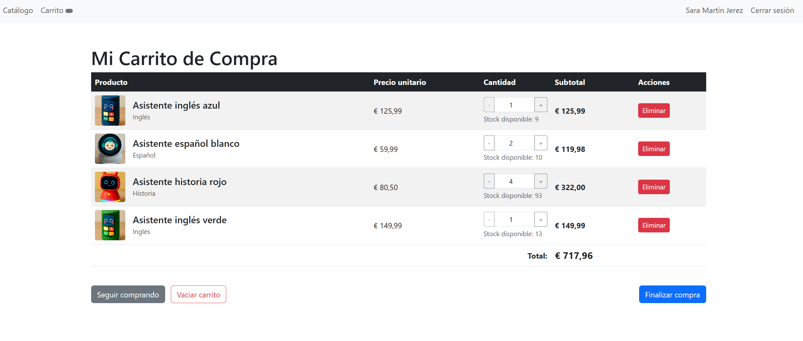
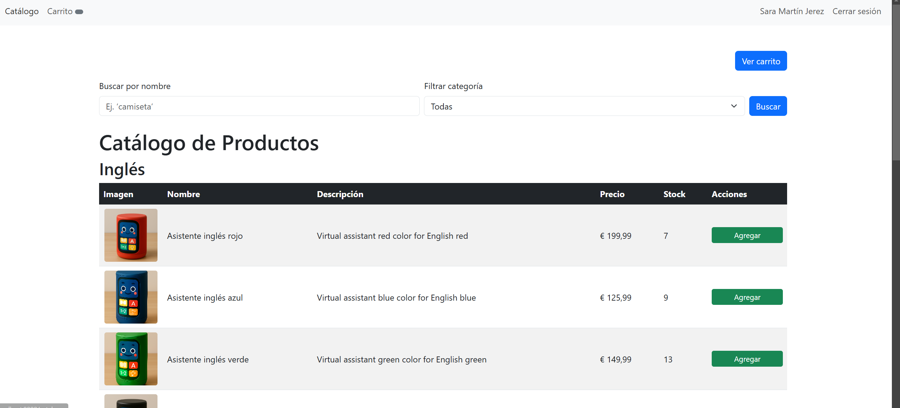

# Tienda Virtual Asisaitenets

**Tienda Virtual Asisaitenets** es un prototipo de plataforma de comercio electrónico educativa, impulsada por IA generativa. Desarrollado por el **Grupo 09** como parte de la asignatura *Sistemas de Información para Empresas* del Departamento de Lenguajes y Sistemas Informáticos.

---

## Visión general

Tienda Virtual Asisaitenets está diseñada para demostrar cómo una **solución de e-commerce** puede integrarse con **IA generativa** para mejorar la experiencia del usuario: desde recomendaciones automáticas de productos hasta generación de descripciones inteligentes. Este prototipo ilustra todo el flujo de compra, desde el registro hasta la confirmación del pago.

---

## Características principales

* **Registro e inicio de sesión**: gestión de usuarios con validación de datos.
* **Catálogo dinámico**: listados filtrables por categoría y búsquedas combinadas por nombre y otros atributos.
* **Carrito interactivo**: adición, eliminación y ajuste de cantidades con actualización en tiempo real mediante AJAX.
* **Checkout y pasarela de pago simulada**: formulario validado de dirección, postal y provincia, con selección de método de pago.
* **Gestión de stock**: stock mínimo en 0 oculta el producto.
* **Simulación de facturación**: generación de factura en pantalla sin almacenamiento permanente.
* **IA generativa (futura expansión)**: generación asistida de descripciones y recomendaciones.

---

## Tecnologías empleadas

| Capa     | Tecnología      | Descripción                                           |
| -------- | --------------- | ----------------------------------------------------- |
| Frontend | HTML, Bootstrap | Maquetación responsiva y componentes UI predefinidos. |
| Backend  | PHP 8           | Lógica de negocio, controladores y validaciones.      |
| BBDD     | SQLite          | Almacenamiento ligero en archivo único `tienda.db`.   |
| Control  | Git, GitHub     | Control de versiones y colaboración remota.           |

---

## Arquitectura y estructura del proyecto

```
├── config/                 # Configuración de conexión y constantes
│   └── database.php        # Configuración PDO para SQLite
├── controllers/            # Controladores MVC
│   ├── AuthController.php  # Registro, login, logout
│   ├── CatalogoController.php # Listado y filtros de productos
│   └── CarritoController.php  # Lógica de carrito y checkout
├── models/                 # Modelos de datos
│   ├── users.php           # CRUD de usuarios
│   ├── producto.php        # CRUD de productos
│   ├── Carrito.php         # Clase carrito (sesión)
│   └── ItemCarrito.php     # ítems individuales del carrito
├── db/                     # Base de datos SQLite
│   └── tienda.db           # Fichero con script de creación de tablas y datos
├── public/                 # Recursos accesibles públicamente
│   ├── index.php           # Router frontal (enrutamiento básico)
│   ├── css/                # Estilos propios
│   │   └── catalogo.css    # Personalizaciones de Bootstrap
│   └── images/             # Imágenes y logos
│       ├── logo.png
│       ├── pruebauso1.png
│       └── pruebauso2.png
└── views/                  # Vistas (templates PHP)
    ├── header.php          # Cabecera con nav
    ├── footer.php          # Pie de página
    ├── login.php           # Formulario de login/registro
    ├── catalogo.php        # Listado y filtros de productos
    ├── carrito.php         # Visualización y edición de carrito
    └── checkout.php        # Formulario de pago
```

---

## Esquema de la base de datos

```sql
-- Tabla usuarios
CREATE TABLE users (
  id INTEGER PRIMARY KEY AUTOINCREMENT,
  nombre TEXT NOT NULL,
  direccion TEXT NOT NULL,
  email TEXT UNIQUE NOT NULL,
  password TEXT NOT NULL
);

-- Tabla categorías
CREATE TABLE categorias (
  id INTEGER PRIMARY KEY,
  nombre TEXT NOT NULL
);

-- Tabla productos
CREATE TABLE productos (
  id INTEGER PRIMARY KEY,
  nombre TEXT NOT NULL,
  descripcion TEXT,
  precio REAL NOT NULL,
  stock INTEGER NOT NULL,
  categoria_id INTEGER,
  imagen TEXT,
  FOREIGN KEY(categoria_id) REFERENCES categorias(id)
);

-- Tabla carritos
CREATE TABLE carritos (
  id INTEGER PRIMARY KEY AUTOINCREMENT,
  usuario_id INTEGER,
  activo INTEGER DEFAULT 1,
  created_at DATETIME DEFAULT CURRENT_TIMESTAMP,
  FOREIGN KEY(usuario_id) REFERENCES users(id)
);

-- Tabla items_carrito
CREATE TABLE items_carrito (
  id INTEGER PRIMARY KEY AUTOINCREMENT,
  carrito_id INTEGER,
  producto_id INTEGER,
  cantidad INTEGER NOT NULL,
  FOREIGN KEY(carrito_id) REFERENCES carritos(id),
  FOREIGN KEY(producto_id) REFERENCES productos(id)
);
```

---

## Instalación y despliegue

1. **Clonar repositorio**

   ```bash
   git clone <URL_DEL_REPOSITORIO>
   cd tienda_virtual
   ```
2. **Dependencias**: asegurar PHP 8.x y extensiones PDO/SQLite.
3. **Base de datos**: copiar `db/tienda.db` o ejecutar scripts de `db/schema.sql`.
4. **Configuración**: editar `config/database.php` si se renombra la BD.
5. **Servidor local**:

   ```bash
   php -S localhost:8000 -t public
   ```
6. **Navegar**: abrir en `http://localhost:8000`.

---

## Uso y flujo de compra

1. **Registro/Login**:

   * El usuario completa nombre, dirección, email y contraseña.
   * Validación de formato de email y contraseña mínima.
2. **Catálogo**:

   * Visualización de productos por categoría.
   * Filtros: búsqueda por nombre, selección de categoría.
   * Paginación configurable (por defecto 10 productos por página).
3. **Carrito**:

   * Añadir producto: verifica stock y muestra modal de confirmación.
   * Editar cantidad: AJAX actualiza subtotal sin recarga.
   * Eliminar item o vaciar carrito con confirmación.
4. **Checkout**:

   * Formulario: código postal validado (formato español), provincia, notas.
   * Selección de método de pago (Tarjeta, PayPal, Bizum).
   * Al enviar: reduce stock, desactiva carrito y genera simulación de factura.
5. **Cierre de sesión**: tras compra, redirección a login y mensaje de agradecimiento.

---

## Capturas de pantalla







---

## Licencia

Este proyecto está bajo la licencia **MIT**. Consulta el fichero [LICENSE](LICENSE) para más detalles.

---

